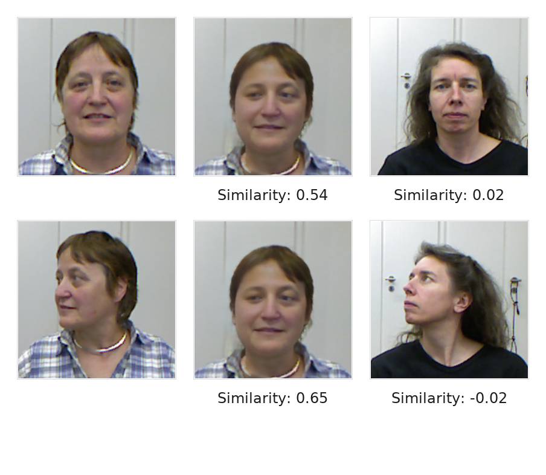
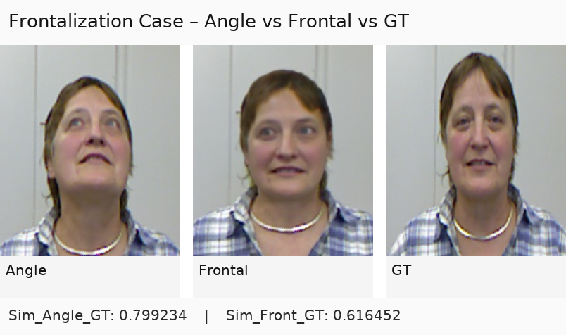
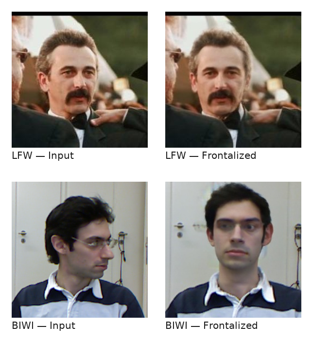
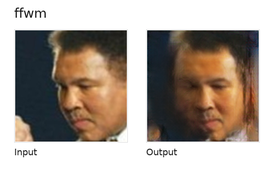
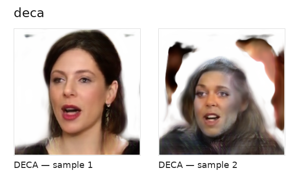

# Frontalization-Face
<div dir="rtl">
> این تسک با محوریت **فرانتال‌سازی چهره** انجام شده است تا ارزیابی‌ها و خروجی‌های به‌صورت شفاف و قابل بازبینی کنار هم قرار بگیرند.

## خلاصهٔ اجرایی 
- **هدف اصلی:** تبدیل تصاویر زاویه‌دار به نمای روبه‌رو (Frontal) به منظور بهبود میزان شباهت به **GT**.
- **سؤال کلیدی:** آیا **Frontal ↔ GT** از **Angle ↔ GT** **بهتر** است؟ یکی از راهای ارزیابی مدل های فرانتال سازی سنجش میزان شباهت به GT است. که هویت فرد بعد از فرانتال سازی هم حفظ شود.
- **داده‌های معیار:** BIWI (۲۴ هویت) +  LFW برای ارزیابی مکمل.
- **مدل‌ها:**, LivePortrait (نسخهٔ ادیت‌شده)، FacePoke، FSRT، Face-frontalization-in-image-sequences-using-GAN-Inversion, AniPortrait، scaleway/frontalization، FFWM

---

## نتایج کمی فرانتال شده
### 1) شباهت فرانتال در برابر زاویه‌دار نسبت به GT

<div align="center">

| Model | Dataset | Mean(Angle↔GT) | Mean(Frontal↔GT) | Net Gain | N |
|---|---|---:|---:|---:|---:|
| LivePortrait | BIWI | 0.82 | 0.52 | -0.30 | 15678 |
| LivePortrait  | LFW | 0.66 | 0.61 | -0.4 | 13234 |
---
</div>

**فرمول:** `Net Gain = similarity(Frontal, GT) − similarity(Angle, GT)`


### 2)  نتایج بهبود مدل بر شباهت (پس پردازش و پیش پردازش) 

<div align="center">
  
| Enhancement | Retina+R100 | SCRFD+R100 | Retina+R50 | SCRFD+R50 | N |
|---|---|---:|---:|---:|---|
| Base | - | 0.519 | - | - | 484 |
| GPFGAN | 0.565 | 0.554 | 0.528 | 0.521 | 484 |
| Sharp | 0.556 | 0.547 | 0.525 | 0.516 | 484 |
| Omit-bg | 0.82 (804 Face Not Detect) | 0.499 | 0.814 (804 Face Not Detect) | 0.468 | 484 |
---
</div>


## نتایج کمی مقایسه بهترین مدل شباهت سنجی
### 3) نتایج مدل شباهت سنجی
<div align="center">

| Group | Retina+R100 | SCRFD+R100 | Retina+R50 | SCRFD+R50 | N |
|---|---|---:|---|---|---|
| Angled vs GT | 0.723 | 0.740 | 0.705 | 0.726 | 15678 |
| Angled vs Angled | 0.714 | 0.725 | 0.695 | 0.707 | 15678 |
| GT vs GT | 0.974 | 0.971 | 0.977 | 0.975 | 15678 |
---
</div>
تطابق هویتی

«خروجیِ فرانتال‌شده با مرجعِ همان فرد (GT) شباهت بیشتری دارد تا با افراد دیگر؛ بنابراین شاید بتوان نتیجه گرفت هویت حفظ می‌شود.»

<p align="center">
  
</p>
«نمونهٔ خودش و نسخهٔ زاویه‌دار، ۰٫۷۴ شباهت دارند (≈۷۴٪).»

## نتایج کیفی (نمونه‌تصویرها)


### A) Angled → Frontal → GT (سه‌تایی نمونه)
<p align="center">
  
</p>


### B) Model Output Quality — LFW & BIWI

<p align="center">
  
</p>


---

## راهنمای اضافه‌کردن خروجی‌ها
1) **عکس‌ها** را داخل `results/angled/examples/` و `results/frontal/examples/` و `results/GT/` کپی کن و آدرس‌ها را در جدول‌های بالا جایگزین کن.  
2) **جداول CSV** را در مسیر `results/templates/` پر کن؛ اگر بخواهی، می‌توانیم اسکریپ‌های کوچک برای رندر خودکار این جدول‌ها به README بسازیم.
3) اگر خواستی «Master Report» بسازیم، فایل‌های CSV را یکی کنیم و یک جدول خلاصه + نمودار اضافه کنیم.

---

# Identity-similarity
## Face Identity Similarity (شباهت هویت چهره)

**مقایسهٔ پایپ‌لاین‌های بهبود و فرانتال‌سازی چهره** برای سنجش اینکه کدام روش/مجموعه‌عکس‌ها بیشترین شباهت هویتی را نسبت به تصویر مرجع (GT) حفظ می‌کنند—در سه حالت:
- **بدون زاویه (Non‑Angled):** تصاویر تمام‌رخ یا با زاویه‌ی ناچیز.
- **زاویه‌دار (Angled):** مقایسه‌ی *Angle ↔ GT* و نیز *Angle ↔ Angle* (سازگاری درون‌زاویه‌ای).
- **Frontalization (فرانتال‌سازی):** مقایسه‌ی شباهت تصاویر فرانت‌شده از نمونه‌های زاویه‌دار با:  
  1) تصاویر زاویه‌دار اولیه، و 2) تصاویر پایه (GT).

### ترکیب‌های مدل برای محاسبهٔ شباهت
برای تشخیص چهره از **RetinaFace** و **SCRFD** و برای شناسایی/استخراج بردار هویت از **ResNet50** و **ResNet100** استفاده شده است. چهار ترکیب زیر ارزیابی شده‌اند:
- RetinaFace + ResNet100
- RetinaFace + ResNet50
- SCRFD + ResNet100
- SCRFD + ResNet50

### داده‌ها
- **BIWI**: دیتاست مربوط به چهره و زوایای مختلف سر، شامل **۲۴ هویت**؛ برای ارزیابی درصد/نمرهٔ شباهت استفاده شده است.
- **LFW**: برای ارزیابی مکمل و سنجش عمومی شباهت هویت.

---
### یادداشت پژوهشی
در این مسیر، برخی مدل‌ها **عملکرد بسیار ضعیفی** داشتند. به همین دلیل تصمیم گرفتیم **مدل LivePortrait** را **ویرایش** کنیم تا **هر ورودی تصویری** را فرانتال کند و خروجیِ تمام‌رخ تحویل دهد. این تسک **توسط خودِ من انجام شد** و در نتایج این مخزن منعکس شده است.

---

## مدل‌ها و پس‌پردازش

### مدل‌های فرانتال‌سازی (نمونه‌های استفاده/مرجع)
- **FacePoke** — ابزار تعاملی برای دست‌کاری مستقیم تصویر و حرکتِ سر؛ مبتنی بر LivePortrait.
- **LivePortrait** — مدل سبک و کارآمد برای انیمیشن چهره با قابلیت **stitching** و **retarget control**.
- **AniPortrait** — انیمیشن چهره بر مبنای صدا و **face reenactment**.
- **FSRT (CVPR 2024)** — چارچوب بازاجرای چهره با درنظرگرفتن زاویه‌ی سر، احساسات و ظاهر.
- **scaleway/frontalization** — فرانتال‌سازی مبتنی بر **GAN** با استفاده از **NVIDIA DALI** برای پردازش سریع.
- **FFWM (ECCV 2020)** — مدل وارپ مبتنی بر **optical flow** با نظارت اپتیکال برای تبدیل به نمای روبه‌رو.

### مدل‌های شباهت‌سنجی
- تشخیص چهره: **RetinaFace**، **SCRFD**
- استخراج ویژگی/شناسایی: **ResNet50**، **ResNet100**

---


## Methodology 

### پیش‌پردازش (Pre-processing)
- تشخیص و برش چهره (Face Detection & Cropping) با آستانه‌های سازگار.
- آماده‌سازی ورودی برای مدل‌های فرانتال‌سازی و استخراج ویژگی.

### فرانتال‌سازی (Frontalization)
- اجرای مدل‌های منتخب (از جمله **LivePortrait** ادیت‌شده) روی تصاویر زاویه‌دار.
- تولید خروجی‌های تمام‌رخ برای مقایسه با تصاویر مرجع (GT).

### پس‌پردازش (Post-processing)
- تصحیح‌های سبک (مثلاً حذف حاشیه‌های ناخواسته، یکنواخت‌سازی رنگ/شارپنس در حد کم).
- اطمینان از سازگاری اندازه و کادر خروجی با ورودی‌های مرجع برای مقایسهٔ دقیق.
- تلاش برای حفظ embedding های خروجی توسط insightface
- بهبود کیفیت تصاویر خروجی از  LivePortrait توسط مدل GPFGAN

### پروتکل ارزیابی (Evaluation Protocol)
1) **Baseline (بدون زاویه):** محاسبهٔ شباهت روی جفت‌های GT به‌عنوان خط مبنا.  
2) **زاویه‌دار (Angled):**
   - سنجش **Angle ↔ GT** (همان هویت).
   - سنجش **Angle ↔ Angle** (سازگاری درون‌زاویه‌ای).  
3) **فرانتال‌سازی:** اعمال مدل‌های فرانتال‌سازی روی تصاویر زاویه‌دار و سنجش **Frontal ↔ GT**.  
4) **Net Gain فرانتال‌سازی:**  
   	`Net Gain = similarity(Frontal, GT) − similarity(Angle, GT)`  
5) **گزارش نهایی:** میانگین‌ها، توزیع امتیازها و شمار **برنده‌ها** در مقایسه‌های دوتایی.

### نکتهٔ اجرایی
در جریان آزمایش‌ها مشاهده شد برخی مدل‌ها عملکرد مطلوبی نداشتند؛ بنابراین **مدل LivePortrait** شخصی‌سازی/ادیت شد تا **هر تصویر ورودی** را به نمای روبه‌رو تبدیل کند. این بهبود **توسط من انجام شده** و در نتایج لحاظ شده است.

---

## داده‌ها (Datasets)
- **BIWI** — مجموعه‌ای با زوایای مختلف سر و **۲۴ هویت** برای سنجش شباهت در شرایط زاویه‌دار.
- **LFW** — برای ارزیابی مکمل/عمومی شباهت هویت و تحلیل رفتار مدل‌های فرانتال‌سازی.

---

## مدل‌ها (Models)
- **تشخیص چهره:** RetinaFace، SCRFD  
- **استخراج ویژگی/شناسایی:** ResNet50، ResNet100  
- **فرانتال‌سازی/بازاجرا:** FacePoke، LivePortrait (ادیت‌شده)، AniPortrait، FSRT، scaleway/frontalization، FFWM

### ترکیب‌های مورد ارزیابی برای شباهت
- RetinaFace + ResNet100  
- RetinaFace + ResNet50  
- SCRFD + ResNet100  
- SCRFD + ResNet50

---

## ساختار پیشنهادی مخزن (Repository Structure)
```
project-root/
├─ data/
│  ├─ GT/                      # تصاویر مرجع
│  ├─ Angle/                   # تصاویر زاویه‌دار
│  ├─ gfp_detail_only/         # output.(jpg|png)
│  ├─ identity/                # output.*, output_gfpgan_detail.*, output_gfpgan_full.*
│  ├─ sharp_only/              # gen_before_refine_arcface.*, gen_after_refine_arcface.*, output.*
│  └─ without_bg/              # gen_before_refine_arcface.*, gen_after_refine_arcface.*
├─ scripts/
│  ├─ preprocess.py            # برش/هم‌ترازسازی/نرمال‌سازی ورودی‌ها
│  ├─ frontalize.py            # اجرای مدل‌های فرانتال‌سازی (گزینش مدل با آرگومان)
│  ├─ extract_embeddings.py    # خروجی‌گرفتن بردارهای هویت (ResNet50/100)
│  ├─ compute_similarity.py    # محاسبهٔ شباهت و ذخیرهٔ CSV/Parquet
│  ├─ summarize.py             # ساخت جدول نتایج، شمارش برنده‌ها و میانگین‌ها
│  └─ viz.py                   # نمودارها/ویژوالیزیشن
├─ results/
│  ├─ non_angled/              # خروجی‌ها و جداول سنجش حالت بدون زاویه
│  ├─ angled/                  # خروجی‌ها و جداول سنجش حالت زاویه‌دار
│  ├─ frontal/                 # خروجی‌ها و جداول سنجش حالت فرانتال‌شده
│  └─ master/                  # جدول/گزارش تجمیعی نهایی
└─ README.md
```

---

## اجرای نمونه (Quickstart)
```bash
# 1) پیش‌پردازش
python scripts/preprocess.py --in data/Angle --out data/Angle_pre --align

# 2) فرانتال‌سازی (مثال: LivePortrait ادیت‌شده)
python scripts/frontalize.py --model liveportrait_mod --in data/Angle_pre --out results/frontal/images

# 3) استخراج بردار هویت (مثال: RetinaFace + ResNet100)
python scripts/extract_embeddings.py --detector retina --backbone resnet100 --in data/ --out results/embeddings

# 4) محاسبهٔ شباهت و گزارش
python scripts/compute_similarity.py --pairs spec/pairs.yaml --emb results/embeddings --out results/metrics.csv
python scripts/summarize.py --metrics results/metrics.csv --out results/master_report.csv
```


## یادداشت‌ها
<div align="center" dir="rtl">

## 🔎 Related Models (Full List)

| Model | Code | Paper | Repo | Trainable | Short Note |
|:--:|:--:|:--:|:--:|:--:|--|
| FacePoke | ✓ | ✓ | [GitHub](https://github.com/jbilcke-hf/FacePoke) | ✓ | ابزار تعاملی مبتنی بر LivePortrait برای جابه‌جایی سر و حالت‌های چهره |
| LivePortrait | ✓ | ✓ | [GitHub](https://github.com/KwaiVGI/LivePortrait) | ✓ |  مدل سبک و سریع برای انیمیشن پرتره با کلیدپوینت‌های ضمنی، پشتیبانی از **retargeting** و **stitching**؛ مناسب تولید حرکت روان از یک تصویر ثابت و پایهٔ خوبی برای فرانتال‌سازی.|
| headGAN | ✓ | ✓ | [GitHub](https://github.com/michaildoukas/headGAN) | ✓ | بازاجرای چهره و ساخت آواتار ویدیویی از یک تصویر ثابت—تغییر حالت/زاویه، دیپ‌فیک کنترل‌شده و افزایش دادهٔ آموزشی. |
| FSRT | ✓ | ✓ | [GitHub](https://github.com/andrerochow/fsrt) | ✓ |  مدل ترنسفورمری برای بازاجرای چهره که با تفکیک **ظاهر** از **هدپوز/احساسات**، حرکت را از ویدئوی محرّک به چهرهٔ منبع منتقل می‌کند (CVPR 2024). |
| Fantasy-Portrait | ✓ | ✓ | [GitHub](https://github.com/Fantasy-AMAP/fantasy-portrait) | – | برای انیمیشن/reenactment طراحی شده؛ می‌شه با درایور خنثی به نمای نزدیک فرانتال رسید، اما در سناریوی فرانتال‌سازی خالص پایداری و حفظ هویت ضعیف‌تر از LivePortraitه. |
| HunyuanPortrait | ✓ | ✓ | [GitHub](https://github.com/Tencent-Hunyuan/HunyuanPortrait) | – |  مدل دیفیوشنی تنسنت برای انیمیشن/بازاجرای پرتره تک‌تصویری با کنترل **pose/expression** و تأکید بر پیوستگی زمانی و کیفیت بصری.|
| X-Portrait | ✓ | ✓ | [GitHub](https://github.com/bytedance/X-Portrait) | – | مدل بایت‌دنس برای بازاجرای/انیمیشن پرتره از یک تصویر ثابت با درایور ویدئویی |
| First-Order-Model | ✓ | ✓ | [GitHub](https://github.com/AliaksandrSiarohin/first-order-model) | ✓ | مدل کلیدیِ انیمیشن تصویر با کی‌پوینت‌های یادگرفتنی و میدان حرکت چگال که یک عکس ثابت را با ویدئوی محرّک به‌صورت واقع‌گرایانه به حرکت درمی‌آورد |
| scaleway/frontalization | ✓ | – | [GitHub](https://github.com/scaleway/frontalization) | – |  پیاده‌سازی سادهٔ فرانتال‌سازی چهره با GAN و DALI—مناسب آزمایش/آموزش، نه کیفیت تولیدی در حد مدل‌های مدرن.|
| FFWM | ✓ | ✓ | [GitHub](https://github.com/csyxwei/FFWM) | ✓ | روش فرانتال‌سازی مبتنی بر وارپ/جریان نوری (optical flow) با ماژول‌های ویژهٔ هم‌ترازی—در نورهای نامتوازن حساس است و ممکن است آرتیفکت بدهد. |
| DA-GAN | – | – | [GitHub](https://github.com/YuYin1/DA-GAN) | – | فرانتال‌سازی زاویه‌های بزرگ با مکانیزم **Dual-Attention** (self + face) برای حفظ هویت و جزئیات در نماهای سخت. |
| TP-GAN | ✓ | ✓ | [GitHub](https://github.com/HRLTY/TP-GAN) | – | فرانتال‌سازیِ چهره با معماری **دو‌مسیره** (مسیر سراسری + مسیرهای محلی برای چشم/بینی/دهان) جهت حفظ هویت و جزئیات در زاویه‌های بزرگ |
| DECA | ✓ | ✓ | [GitHub](https://github.com/yfeng95/DECA) | ✓ | بازسازی سه‌بعدی چهره با **3DMM** از یک تصویر و رندر مجدد؛ امکان **صفر کردن pose** و گرفتن نمای فرانتال با حفظ ساختار هندسی. |
| NVLabs EG3D | – | – | [GitHub](https://github.com/NVlabs/eg3d?utm_source=chatgpt.com) | – | با **inversion** می‌توان از یک چهره نماهای جدید ازجمله **frontal** رندر کرد، |
| HRN | – | – | [GitHub](https://github.com/youngLBW/HRN) | – | بازسازی سه‌بعدی چهره از یک تصویر |
| pixel3DMM | – | – | [GitHub](https://github.com/SimonGiebenhain/pixel3dmm) | – |  بازسازی سه‌بعدی چهره با و رندرساز سازگار با نما—برای چرخاندن pose و گرفتن نمای **frontal** مفید است، ||
| CVTHead | ✓ | ✓ | [GitHub](https://github.com/HowieMa/CVTHead) | ✓ | روش WACV 2024 برای ساخت آواتارِ سرِ قابل‌کنترل از یک تصویر واحد با *Vertex-Feature Transformer*؛ با ضرایب **3DMM** امکان کنترل صریح **pose/expression/view** را می‌دهد. |
| Face-frontalization-in-image-sequences-using-GAN-Inversion | ✓ | – | [GitHub](https://github.com/mhahmadi258/Face-frontalization-in-image-sequences-using-GAN-Inversion) | ✓ | **Face-frontalization-in-image-sequences-using-GAN-Inversion:** فرانتال‌سازی چهره در توالی تصاویر با **GAN Inversion**؛ از یک ویدئو/دنبالهٔ تک‌فریم‌ها، نمای روبه‌رو تولید می‌کند با تأکید بر **حفظ هویت** و **سازگاری زمانی** (پارامتر کم و اجرای سبک).|

> **یادداشت:** ستون‌های «Code/Paper» بر اساس لینک‌های موجود شما پر شده‌اند. اگر برای هر کدام مقاله/لینک دقیق‌تری دارید، اضافه می‌کنم. همچنین لینک‌های تکراری/خراب (مثل DECA دوبار) یک‌دست شدند.

</div>


- من این مدل‌ها را هم اجرا گرفتم، اما هر کدام به دلیلی نتیجهٔ مطلوبی نداشتند و در بسیاری موارد خروجی‌ها واقعاً ضعیف (حتی «افتضاح») بود.


## Failure Cases — FFWM
در برخی نمونه‌ها، خروجی **FFWM** دچار آرتیفکت شدید و افت هویت شد. نمونه‌ی زیر:

<p align="center">
  
</p>

## Failure Cases — DECA
در این ورودی، بازسازی سه‌بعدی و رندر مجدد باعث blur و artifact شده و شباهت ادراکی به GT کاهش یافته است

<p align="center">
  
</p>
 </div>
